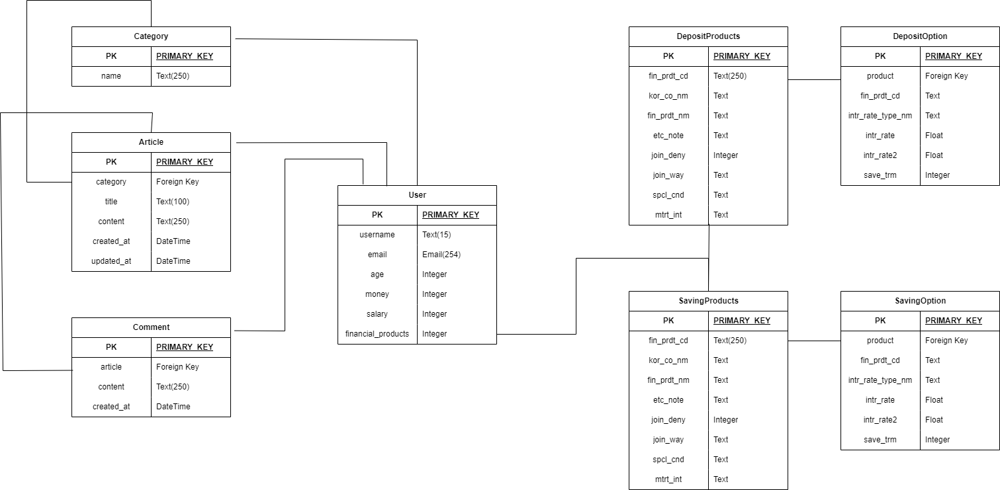
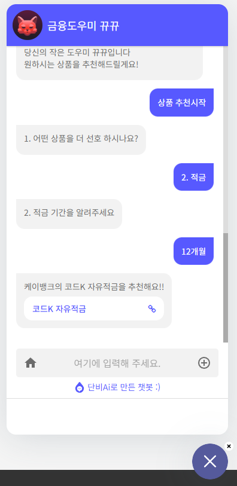
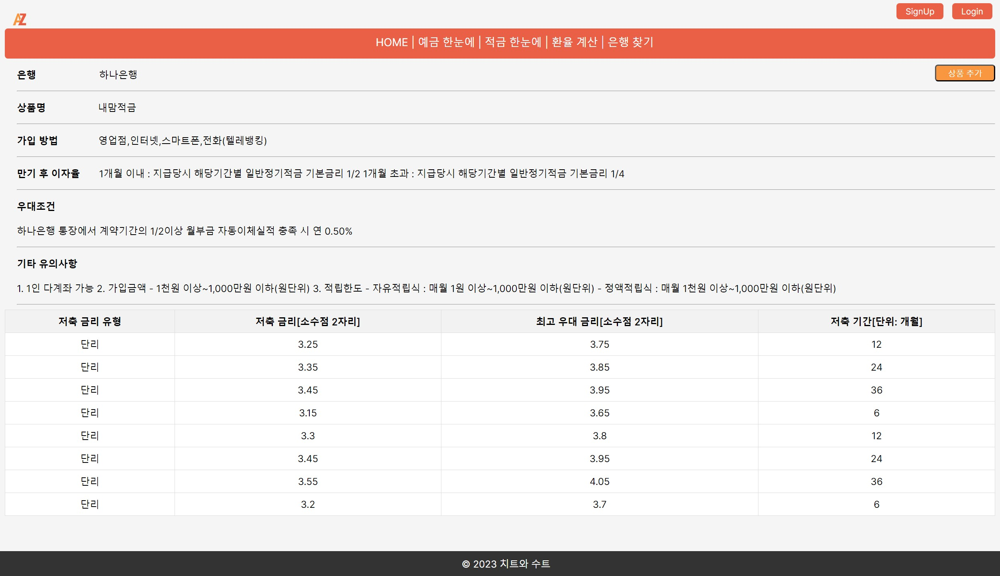
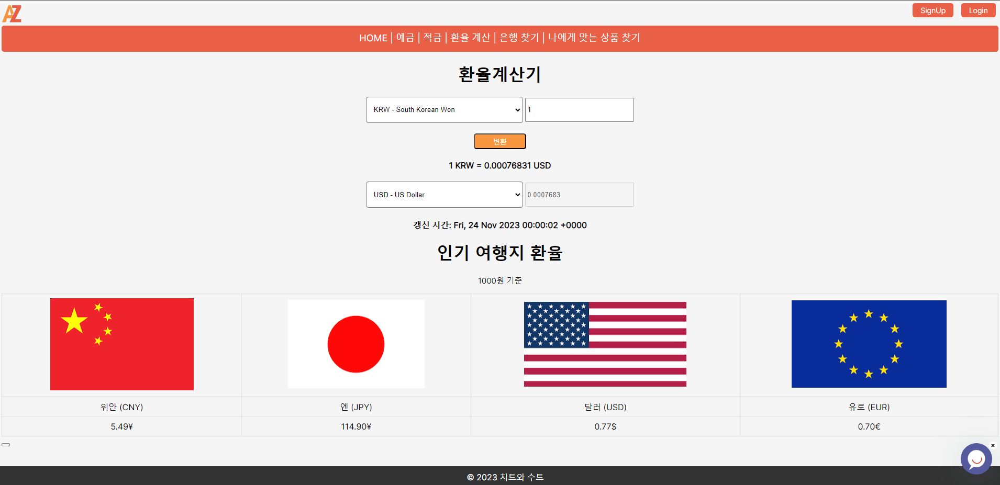
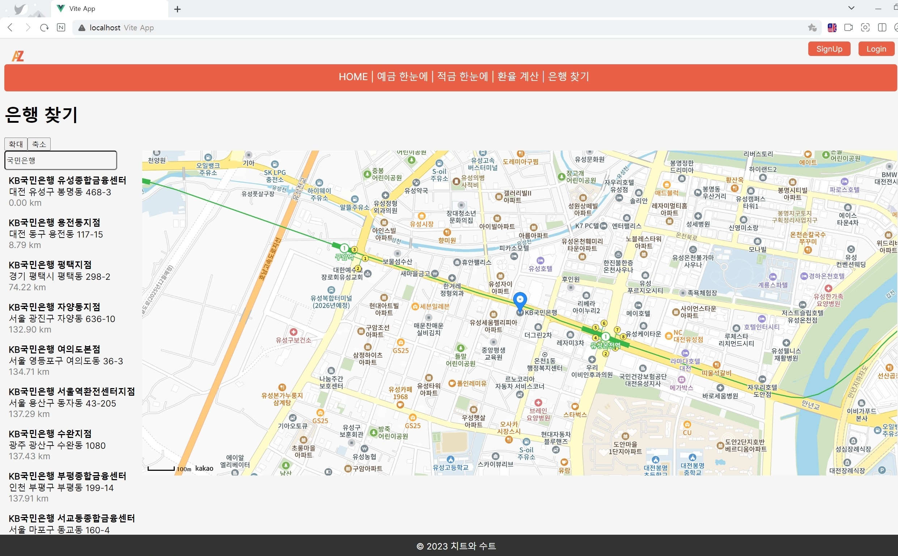
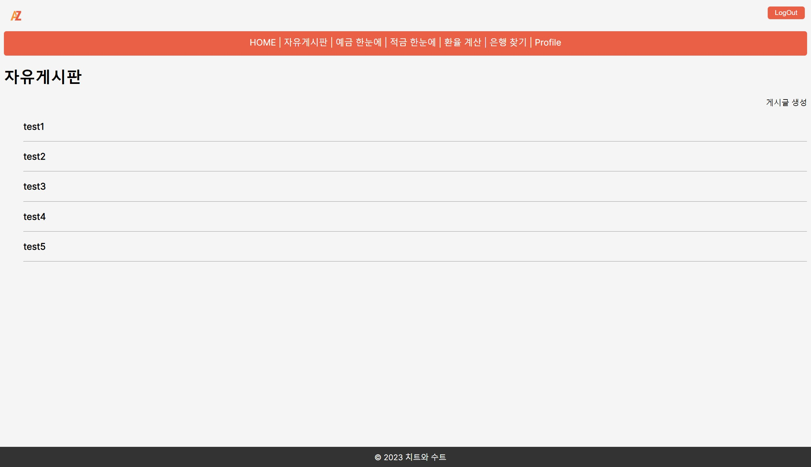

# AZ Finance (FINAL - PJT)

## I. 팀원 정보 및 업무 분담 내역
## 팀명 : 치트와 수트
### 팀장 : 오치승
- 맵을 활용한 은행 검색 페이지 구현(Back, Front)
- 환율 계산기 페이지 구현(Back, Front)
- 금융 상품 추천 알고리즘 구현
### 팀원 : 임태수
- 예,적금 금리비교 페이지 구현(Back, Front)
- 커뮤니티 게시판 페이지 구현(Back, Front)
- 회원 커스터마이징, 프로필 페이지 구현(Back, Front)
- 메인페이지 설계(Front)

## II. 설계 내용(아키텍처 등) 및 실제 구현 정도
### FRONT
```
front
 ┗ final-pjt-front
 ┃ ┣ public
 ┃ ┃ ┗ favicon.ico
 ┃ ┣ src
 ┃ ┃ ┣ components
 ┃ ┃ ┃ ┣ CommentCreate.vue
 ┃ ┃ ┃ ┗ CommentList.vue
 ┃ ┃ ┣ router
 ┃ ┃ ┃ ┗ index.js
 ┃ ┃ ┣ stores
 ┃ ┃ ┃ ┣ articles.js
 ┃ ┃ ┃ ┣ auth.js
 ┃ ┃ ┃ ┣ categories.js
 ┃ ┃ ┃ ┣ comments.js
 ┃ ┃ ┃ ┗ finlife.js
 ┃ ┃ ┣ views
 ┃ ┃ ┃ ┣ ArticleCreateView.vue
 ┃ ┃ ┃ ┣ ArticleDetailView.vue
 ┃ ┃ ┃ ┣ ArticleUpdateView.vue
 ┃ ┃ ┃ ┣ ArticleView.vue
 ┃ ┃ ┃ ┣ CategoryCreateView.vue
 ┃ ┃ ┃ ┣ DepositProductDetailView.vue
 ┃ ┃ ┃ ┣ ExchangeRateView.vue
 ┃ ┃ ┃ ┣ FinanceDepositProductView.vue
 ┃ ┃ ┃ ┣ FinanceSavingProductView.vue
 ┃ ┃ ┃ ┣ LoginView.vue
 ┃ ┃ ┃ ┣ MainView.vue
 ┃ ┃ ┃ ┣ MapView.vue
 ┃ ┃ ┃ ┣ ProfileView.vue
 ┃ ┃ ┃ ┣ SavingProductDetailView.vue
 ┃ ┃ ┃ ┗ SignUpView.vue
 ┃ ┃ ┣ App.vue
 ┃ ┃ ┗ main.js
 ┃ ┣ .gitignore
 ┃ ┣ index.html
 ┃ ┣ package-lock.json
 ┃ ┣ package.json
 ┃ ┣ README.md
 ┃ ┗ vite.config.js
```
### BACK
```
back
 ┣ accounts
 ┃ ┣ migrations
 ┃ ┃ ┣ __pycache__
 ┃ ┃ ┣ 0001_initial.py
 ┃ ┃ ┗ __init__.py
 ┃ ┣ __pycache__
 ┃ ┣ admin.py
 ┃ ┣ apps.py
 ┃ ┣ models.py
 ┃ ┣ serializers.py
 ┃ ┣ signals.py
 ┃ ┣ tests.py
 ┃ ┣ urls.py
 ┃ ┣ views.py
 ┃ ┗ __init__.py
 ┣ articles
 ┃ ┣ migrations
 ┃ ┃ ┣ __pycache__
 ┃ ┃ ┣ 0001_initial.py
 ┃ ┃ ┗ __init__.py
 ┃ ┣ __pycache__
 ┃ ┣ admin.py
 ┃ ┣ apps.py
 ┃ ┣ models.py
 ┃ ┣ serializers.py
 ┃ ┣ tests.py
 ┃ ┣ urls.py
 ┃ ┣ views.py
 ┃ ┗ __init__.py
 ┣ final_pjt_back
 ┃ ┣ __pycache__
 ┃ ┣ asgi.py
 ┃ ┣ settings.py
 ┃ ┣ urls.py
 ┃ ┣ wsgi.py
 ┃ ┗ __init__.py
 ┣ finlife
 ┃ ┣ migrations
 ┃ ┃ ┣ __pycache__
 ┃ ┃ ┣ 0001_initial.py
 ┃ ┃ ┗ __init__.py
 ┃ ┣ __pycache__
 ┃ ┣ admin.py
 ┃ ┣ apps.py
 ┃ ┣ models.py
 ┃ ┣ serializers.py
 ┃ ┣ tests.py
 ┃ ┣ urls.py
 ┃ ┣ views.py
 ┃ ┗ __init__.py
 ┣ .gitignore
 ┣ db.sqlite3
 ┣ manage.py
 ┗ requirements.txt
```

1. 메인 페이지 (100%)
2. 회원 커스터마이징 (100%)
3. 예적금 금리 비교 (100%)
4. 환율 계산기 (100%)
5. 근처 은행 검색 (100%)
6. 커뮤니티(게시판) (100%)
7. 프로필 페이지 (70%)<br>
 - 금융 상품 추천 알고리즘
    - 부족한 이유 : 회원정보수정, 탈퇴, 상품추가 기능동작(X)
8. README (100%)


## III. 데이터베이스 모델링(ERD)



## IV. 금융 상품 추천 알고리즘에 대한 기술적 설명
챗봇을 통한 금융 상품 추천이다. 설문조사를 통해 상품을 추천할 경우 피로감에 제대로 된 답변을 얻기 힘들어 챗봇을 통한 방식을 채택하였다. 챗봇에 현재 데이터를 학습시킨 후, 고객 맞춤형 상품을 출력해주고 상세정보로 이동할 수 있도록 링크를 제공했다. 예적금 기간, 최고 금리를 우선으로 추천하도록 학습하였다.사용자가 자신이 우대사항에 해당되는지 확인하기 까다롭기 때문에 그 부분은 생략하고 알고리즘을 만들게 되었다. <br>
우측 하단에 채팅버튼을 누르게 되면 학습되어있는 챗봇이 대화형식으로 질문을 주게 된다. 질문에 대한 답변은 선택을 하여 넘어갈 수 있으며 답변이 완료되면 상품추천을 하여 페이지로 이동할 수 있도록 제공한다. 채팅을 통해서도 가능하다. <br>
지금은 제공할 수 있는 데이터가 정해져 있지만 데이터양이 증가한다면 조금 더 정확한 상품을 추천할 수 있을 것으로 보인다.


## V. 서비스 대표 기능들에 대한 설명
### 챗봇을 통한 금융 상품 추천

<br>
챗봇에 현재 데이터베이스에 가지고 있는 데이터를 학습시켜 원하는 항목을 선택하면 선택한 항목과 유사한 상품을 출력해주고 상세정보로 이동할 수 있도록 링크를 제공하였다. 우측 하단에 채팅버튼을 누르게 되면 학습되어있는 챗봇이 대화형식으로 질문을 주게 된다. 질문에 대한 답변은 선택을 하여 넘어갈 수 있으며 답변이 완료되면 상품추천을 하여 페이지로 이동할 수 있도록 제공한다. 채팅을 통해서도 가능하다.

#### 예적금 금리 비교 페이지
<br>
페이지에 DB에 저장된 데이터들을 불러와 화면에 테이블 형태로 출력을 하였다. 상단 검색창에 은행 명을 검색하면 필터링되어 원하는 은행의 예적금 데이터를 확인할 수 있다. 또한 가나다순 정렬도 사용 가능하게 하였다. 상세 데이터는 원하는 예적금 데이터를 클릭하면 확인할 수 있도록 라우터를 설정하였다.

#### 환율 계산기
<br>
해외에서 사용하는 환율에 대한 API키를 받아 계산할 수 있도록 하였다. 한국수출입은행에서 제공하는 데이터보다 더 많은 데이터를 가지고 올 수 있어서 다른 API를 사용하였고, 때문에 좀 더 많은 나라의 환율 데이터를 확인할 수 있다. 또한 자주 검색하는 국가에 대해서 1000원에 대한 환율을 계산하여 테이블을 통해 출력하였다.

#### 지도를 통한 은행 검색
<br>
카카오맵 API데이터를 통해 은행을 검색하면 리스트를 출력하고 클릭을 하면 지도에 마커로 표시되도록 하였다. 확대 축소기능 또한 같이 활용되어 지도 사용에 대한 접근성을 높였다.

#### 커뮤니티
<br>
기본적인 형태의 커뮤니티이지만 작성자를 확인할 수 없도록 하였다. 다만 로그인을 하지 않으면 접속을 할 수 없도록 하였기 때문에 커뮤니티에 작성을 하기 위해서는 회원가입 후 로그인을 한 후에 작성하도록 하였다.


##  VI. 후기


## 일정
프로젝트 기간 : 2023.11.16(목) ~ 20232.11.24(금)
|내용|담당|중요도|완료일자|비고|
|---|-|---|---|---|
|프로젝트 설계 및 역할 분담|공통|상|11.16||
|메인페이지 설계|임태수|상|11.23||
|예적금 금리비교 페이지|임태수|상|11.21||
|환율 계산기 페이지|오치승|중|11.20||
|맵을 활용한 은행 검색 페이지|오치승|중|11.20||
|커뮤니티 게시판 페이지|임태수|중|11.19||
|회원 커스터마이징|임태수|상|11.20||
|프로필 페이지|임태수|중|11.21||
|README|공통|상|11.23||


### 임태수
정말 힘들었다. 이러한 대형 프로젝트는 처음이었기에 힘든 부분이 많았다. 그동안 배운 내용을 여러 방법으로 사용해보고 작업을 하면서 새로운 기능들도 사용하면서 공부할 수 있는 좋은 시간이었던것 같다. 처음 프로젝트 내용을 보고 우리가 할 수 있을까 라는 생각을 가장 먼저 하긴 했지만 여기까지 올 수 있었던건 혼자하는 것이 아니라 같이 하는것이기 때문에 버티면서 프로젝트를 진행할 수 있었고 좋은 경험이 되었다. 


## 오치승
내가 배운 내용을 아는 것과 내가 해내는 것은 다르다고 느꼈다. 지금까지 배웠던 파이썬, 알고리즘, django, Vue를 모두 사용했다. chatGPT 같은 Ai를 사용하더라도 참고용으로 활용해야지 무작정 기대는 것은 아니라고 느꼈다. 너무 구현이 어렵다면 검색해서 비슷한 기능을 실제로 구현해보고, 거기에서 내가 원하는 방식으로 기능들을 추가하는게 먼저라고 느꼈다. 일상을 포기하고 프로젝트에 전부를 쏟아낸 경험은 어디가서도 얻지 못할 경험 같다.